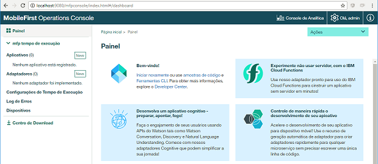

# Android MobileFirst Example App

Simples Android app using IBM MobileFirst Platform.

It provides 2 functionalities, both using basic security:

* View balance
* View statements

## Install IBM MobileFirst SKD

You can download the SDK at <https://mobilefirstplatform.ibmcloud.com/downloads/> (Developer Kit).


Now, let's install the MobileFirst CLI. It won't work with last version of the npm package manager, so you'll need to downgrade to version 3.10.10 (found this solution [here](https://stackoverflow.com/questions/46168090/ibm-mobile-first-mfpdev-cli-installation-failure)). You can find a compatible node.js installer with npm 3.10.10 at <https://nodejs.org/en/download/releases/> (Node.js 7.3.0, Date 2016-12-20, V8	5.4.500.45).

Open a terminal and run `npm install -g mfpdev-cli`

You can the check installation by running `mfpdev -v`:


Now, run the MobileFirst Operations Console. You can find it at installation directory (deafult is `c:\users\your_user\MobileFirst-8.0.0.0`).

1. Execute the batch file `run.cmd` (or run.sh if not windows)
1. Get a coffee while it initializes
1. When it's done, navigate to <http://localhost:9080/mfpconsole/>



* It's in portuguese and I have no idea how to change that.

## MobileFirst Adapter

1. Install and configure [Maven](https://maven.apache.org/download.cgi)

* Run `mvn -v` to check.


1. Open a terminal, go to the directory where you want to create the adapter:
* Run: `mfpdev adapter create`
* Adapter name: `AccountAdapter`
* Choose `Java`
* Package Name: `com.your_domain.app`
* Group ID: have no idea. Just put the same as package name and it's all good.


The java adapter template provides some basic functionality. You can check the adapter resources in file `AccountAdapter\src\com\your_domain\app\AccountAdapterResource.java`.

Let's add our account info resource:

* Open `AccountAdapterResource.java` file for edit.
* Add the code below to your `AccountAdapterResource` class:

```java
@ApiOperation(value = "Returns account basic info", notes = "")
@ApiResponses(value = {
  @ApiResponse(code = 200, message = "Account basic info returned."),
  @ApiResponse(code = 404, message = "Account not found.") })
@Produces(MediaType.APPLICATION_JSON)
@GET
@Path("/account")
public Response getAccountInfo(
  @ApiParam(value = "Account Number", required = true) @QueryParam("acc") String acc) {
  if (acc.equals("12345")) {
    Map<String, Object> result = new HashMap<String, Object>();
    result.put("costumer", "Leeroy Jenkins");
    result.put("balance", 1234.56);
    return Response
      .ok(result).build();
  } else {
    return Response
      .status(Status.NOT_FOUND).build();
  }
}
```

* In terminal, go to your adapter directory and build it: `mfpdev adapter build`


* Then, deploy it: `mfpdev adapter deploy`


* At the operations console, select AccountAdapter, Resources tab and view Swagger docs.


Note that our resource is listed there (/resources/account).

In Swagger page, expand the `Sample Adapter Resource`, then `/resource/account`.

Before testing the resource, we'll need to authenticate. Click the authentication button.


Select `DEFAULT_SCOPE` and `Authorize`. User: `test`, password: `test`.

Now, type our hardcoded account number (12345) and click `Try it out!`.


If you type any other value for parameter `acc`, you'll get an 404 response.

Ok, now we need a Statement class:

```java
class Statement {

  private String description;

  private double value;

  private double balance;

  private char type;

  public Statement(String description, double value, double balance, char type) {
    this.description = description;
    this.value = value;
    this.balance = balance;
    this.type = type;
  }

  public String getDescription() { 
    return description;
  }

  public double getValue() {
    return value;
  }

  public double getBalance() {
    return balance;
  }

  public char getType() {
    return type;
  }
}
```

And our statements resource:

```java
@ApiOperation(value = "Returns account statements", notes = "")
@ApiResponses(value = {
  @ApiResponse(code = 200, message = "Account statements returned."),
  @ApiResponse(code = 404, message = "Account not found.") })
@Produces(MediaType.APPLICATION_JSON)
@GET
@Path("/account/statements")
public Response getAccountStatements(
  @ApiParam(value = "Account Number", required = true) @QueryParam("acc") String acc) {
  if (acc.equals("12345")) {
    List<Statement> result = new ArrayList<Statement>();
    result.add(new Statement("Starbucks", 12.35, 98123.45, 'D'));
    result.add(new Statement("Amazon.com", 999.99, 97123.46, 'D'));
    result.add(new Statement("Poker Vegas D", 53481.65, 43641.81, 'D'));
    result.add(new Statement("Poker Vegas C", 187539.01, 231180.82, 'C'));
    return Response
      .ok(result).build();
  } else {
    return Response
      .status(Status.NOT_FOUND).build();
  }
}
```

Build and deploy: `mfpdev adapter build && mfpdev adapter deploy`


Like the `account` resource, you can test it in MF Operations Console (Swagger).

Ok! All set! Now, our Android app...

## Android Project

Create a new Android Project.

Make sure you have JCenter as one of the repositories that your app will look for dependencies. Open `your_app_project\build.gradle` (root) and check/add:

```xml
buildscript {
  repositories {
    ...
    jcenter()
  }
}
allprojects {
  repositories {
    ...
    jcenter()
  }
}
```

Now, open `your_app_project\app\build.gradle` file for edit. Add:

(We'll be using google [Gson lib](https://github.com/google/gson) to parse our responses)

```xml
android {
  packagingOptions {
    pickFirst 'META-INF/ASL2.0'
    pickFirst 'META-INF/LICENSE'
    pickFirst 'META-INF/NOTICE'
  }
  dependencies {
    implementation 'com.ibm.mobile.foundation:ibmmobilefirstplatformfoundation:8.0.+'
    implementation 'com.google.code.gson:gson:2.8.2'
  }
}
```

MobileFirst will need some permissions and an activity. Edit your `AndroidManifest.xml` (at your_app_project\app\src\main) and add:

```xml
<manifest>
  <uses-permission android:name="android.permission.INTERNET"/>
  <uses-permission android:name="android.permission.ACCESS_WIFI_STATE"/>

  <application>
    <activity android:name="com.worklight.wlclient.ui.UIActivity" />
  </application>
</manifest>
```

According to IBM knowledge center, `UIActivity` is an
> Android Activity class that the IBM Worklight platform uses to display UI (dialogs and such) in an Android environment.

Create the file `our_app_project\app\src\main\assets\mfpclient.properties` with the content:

```txt
wlServerProtocol=http
wlServerHost=10.0.2.2
wlServerPort=9080
wlServerContext=/mfp/
languagePreferences=en
```

The value `10.0.2.2` in wlServerHost is the special alias to your host loopback interface ([explanation here](https://stackoverflow.com/questions/9808560/why-do-we-use-10-0-2-2-to-connect-to-local-web-server-instead-of-using-computer)), so the android emulator can connect to localhost.

Finally, we have to register our app. Open the terminal and go to Android Project root directory and run `mfpdev app register`:


The app should be listed under `Applications` in the MobileFirst Operations Console:


In MobileFirst Operations Console `Applications`, select our app and then `Authenticity`. Turn it on.


Ok! Our app is ready to use our AccountAdapter!

This tutorial is not about Android development, so I won't go through all the details. If you don't know where to copy/paste the code below, just take a look at the source code.

Getting the access token:

```java
// Instantiate client
client = WLClient.createInstance(this);

// Get an access token
WLAuthorizationManager.getInstance().obtainAccessToken(null, new WLAccessTokenListener() {
  @Override
  public void onSuccess(AccessToken accessToken) {
    // ok!
  }

  @Override
  public void onFailure(WLFailResponse wlFailResponse) {
    // error: wlFailResponse.getErrorMsg()
  }
});
```

Request a resource:

```java
WLResourceRequest request = new WLResourceRequest(
  URI.create("/adapters/AccountAdapter/resource/account"),
  WLResourceRequest.GET, null);

  request.setQueryParameter("acc", "12345");

  request.send(new WLResponseListener() {
    @Override
    public void onSuccess(WLResponse wlResponse) {
      // ok!
    }

    @Override
    public void onFailure(WLFailResponse wlFailResponse) {
      // error: wlFailResponse.getErrorMsg()
    }
  );
```

App screens:

 

## Resources

* <https://mobilefirstplatform.ibmcloud.com/downloads/>
* <https://mobilefirstplatform.ibmcloud.com/labs/developers/8.0/intro/>
* <https://mobilefirstplatform.ibmcloud.com/tutorials/en/foundation/8.0/all-tutorials/>
* <https://www.ibm.com/support/knowledgecenter/en/SSHS8R_7.1.0/com.ibm.worklight.dev.doc/dev/t_dev_new_w_gradle.html>
* <https://www.ibm.com/support/knowledgecenter/en/SSHS8R_8.0.0/com.ibm.worklight.dev.doc/dev/t_register_app_android.html>
* <https://www.ibm.com/support/knowledgecenter/en/SSZH4A_6.2.0/com.ibm.worklight.apiref.doc/html/refjava-worklight-android-native/html/com/worklight/wlclient/ui/UIActivity.html>
